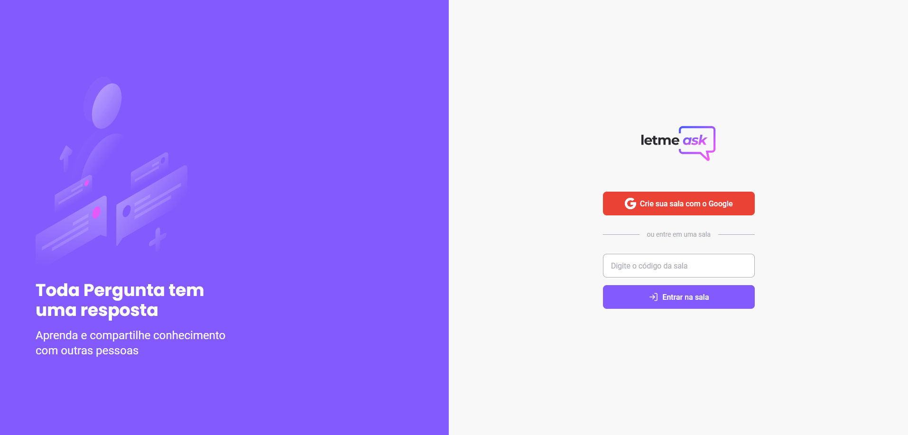
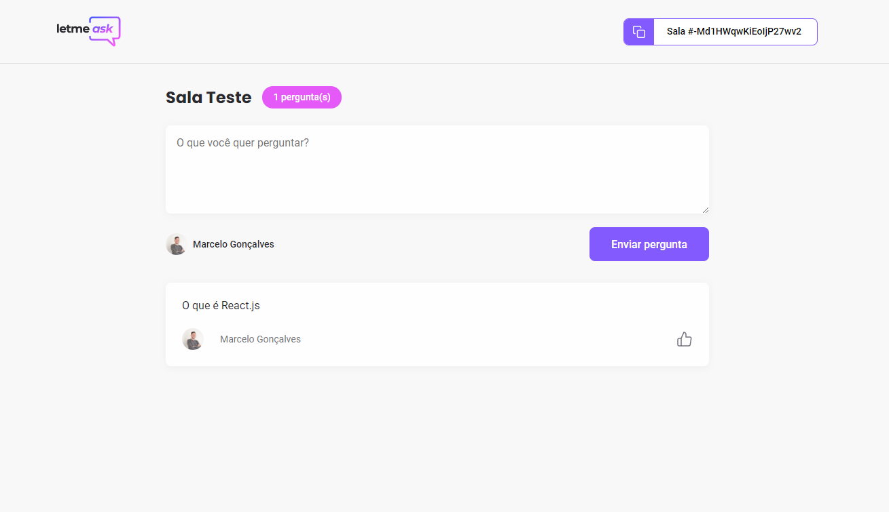
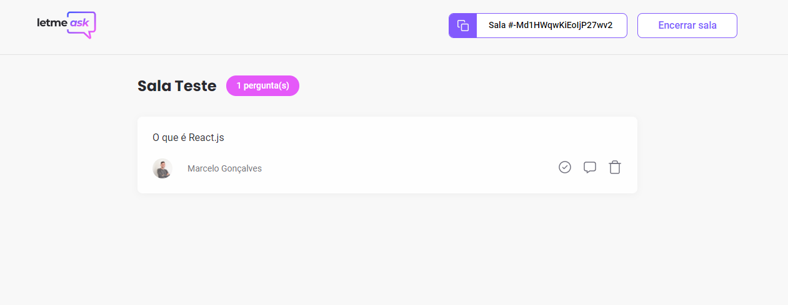

<p align="center">
  
</p>

 <div align="center">
  <!-- LICENSE -->
  
<!-- LAST COMMIT -->
<a href="https://github.com/alissonandrade2020/Letmeask/commits/master">
    
  </a>
<!-- STARS -->
  <a href="https://github.com/alissonandrade2020/Letmeask/stargazers/master">
    
  </a>
  <!-- FORKS -->
  <a href="https://github.com/alissonandrade2020/Letmeask/forks/master">
    
  </a>
  <!-- AUTHOR -->
  
  <!-- LANGUAGES -->
   
  <!-- REPO SIZE -->
  
  <!-- CONTRIBUTORS -->
 
</div>


<h4 align="center">
🚧 NLW#6 - Trilha ReactJS - Letmeask 2.0 🚀 em construção... 🚧
</h4>

---

#### 🚀 Sobre o Projeto

O Letmeask é uma plataforma que tem a proposta de resolver problemas de acumulo de perguntas durante uma live, transmissão, etc. Com ela você pode criar salas privadas onde somente os que possuem o ID da sala podem acessar, os participantes podem fazer perguntas(desde que estejam logados com o Google), votar nas mesmas. Já o criador da sala pode demarcar as perguntas como respondidas, colocar foco, dentre outras funcionalidades.

---

#### 🚀 O que é Next Level Week?

O [NLW](https://nextlevelweek.com/inscricao/6) é uma semana prática com muito código, desafios, network e com um único objetivo: levá-lo ao próximo nível.
Através do método da [Rocketseat](https://rocketseat.com.br/), você aprenderá novas ferramentas, tecnologias e descobrirá hacks que irão impulsionar sua carreira.
Um evento online e totalmente gratuito que o ajudará a dar o próximo passo na sua evolução como desenvolvedor.

---

#### 📋 Funcionalidades

- [x] Como participante
  - [x] Logar com sua conta do google.
  - [x] Criar uma nova sala.
  - [x] Fazer perguntas e enviar.
  - [x] dar like nas perguntas
  - [x] botão para copiar o código da sala.
- [x] Como administrador da sala
  - [x] Pode excluir pergunta.
  - [x] Pode encerrar a sala.
  - [x] Responder as perguntas.

---


#### 🎨 Layout

O layout da aplicação está disponível no Figma:

<a href="https://www.figma.com/file/MT8UU8XfDDCQ3LSrl4PXpE/Letmeask-(Copy)?node-id=0%3A1">
  
</a>

Design feito por [Rebecca Gonzalez](https://dribbble.com/rebeccagonzalez)

---

#### :computer:  Web

<h4 align="center">
  
  <p align="center">Tela inicial - letmeask<p>
</h4>
<h4 align="center">
  
  <p align="center">Tela de perguntas - letmeask<p>
</h4>
<h4 align="center">
  
  <p align="center">Tela Admin - letmeask<p>
</h4>

---

#### 📱 Mobile

<h4 align="center">
  Em breve
</h4>

---

#### :crossed_swords: Desafios para melhorar a aplicação
- [ ] Criar documentação
    - [ ] Vídeo de exemplo
    - [x] Readme-me incrível
    - [ ] Tecnologias usadas
    - [x] Setup do projeto
    - [x] Funcionalidades
    - [ ] Screenshot das páginas
 - [ ] Melhorar estilos
    - [ ] Alguns ajustes para tornar o estilo igual ao layout
    - [ ] Adicionar media queries
    - [ ] Deixar o layout responsivo para mobile, tablet e Desktop
    - [ ] CSS com Styled Components e Mobile First
    - [ ] Switch para alterar os themes
    - [ ] Theme dark na aplicação
    - [ ] Criar modal de encerrar sala
    - [ ] Toast como notificação
    - [ ] Save theme no localStorage
  - [ ] Funcionalidades
    - [ ] Adicionar funcionalidade PWA
    - [ ] Adicionar Autenticação com o Github
  - [ ] Testar a aplicação
    - [ ] Testes com Jest;
    - [ ] Storybook para os component;

---

#### :gear: Tecnologias:

Este projeto foi desenvolvido utilizando as seguintes tecnologias:

- **[React.js](https://pt-br.reactjs.org/)**
- **[TypeScript](https://www.typescriptlang.org/)**
- **[Eslint](https://eslint.org/)**
- **[Prettier](https://prettier.io/)**
- **[Firebase Authentication](https://firebase.google.com/)**
- **[Firebase Realtime Database](https://firebase.google.com/)**
- **[Firebase](https://firebase.google.com/)**
- **[classnames](https://www.npmjs.com/package/classnames)**
- **[React Router Dom](https://reactrouter.com/web/guides/quick-start)**
- **[node-sass](https://www.npmjs.com/package/node-sass)**

---

#### 🚀 Como executar o projeto

##### Pré-requisitos

Antes de começar, você vai precisar ter instalado em sua máquina as seguintes ferramentas:
[Git](https://git-scm.com), [Node.js](https://nodejs.org/en/).
Além disto é bom ter um editor para trabalhar com o código como [VSCode](https://code.visualstudio.com/)

---

#### 👯 Clonando o repositório

```bash
# Clone este repositório
$ git clone https://github.com/alissonandrade2020/Letmeask

# Acesse a pasta do projeto no terminal/cmd
$ cd Letmeask
```

#### 📁 Rodando a Aplicação

```bash
# Instale as dependências
$ yarn or npm install

# Execute a Aplicação em Desenvolvimento
$ yarn start or npm run start

# A aplicação será aberta na porta:3000 - acesse http://localhost:3000

```

#### 📁 Configuração .ENV


```bash
#adicionado .env.example no projeto, lembrar de adicionar as variáveis de ambiente conforme o exemplo

# FIREBASE

REACT_APP_API_KEY=
REACT_APP_AUTH_DOMAIN=
REACT_APP_DATABASE_URL=
REACT_APP_PROJECT_ID=
REACT_APP_STORAGE_BUCKET=
REACT_APP_MESSAGE_SENDING_ID=
REACT_APP_APP_ID=

```

---

#### 🔎 Comandos

- `start`: Executa a aplicação em `localhost:3000`
- `build`: Cria a Build do projeto
<!-- - `start`: Inicia um servidor simples com o código de produção -->

---

<!--
### 💾 Comandos Úteis

```bash
#Criação de um componente completo com (index.tsx / stories.tsx / styles.ts / test.tsx)
$ yarn generate ComponentName

#Rodar o Storybook
$ yarn storybook

#Rodar os testes
$ yarn test

```
-->

<!--

```
# MONGODB
MONGODB_URI=

# API URLS
BASE_URL=


```

-->

#### 💪 Como contribuir para o projeto

1. 🍴 Faça um **fork** do projeto.
2. 👯 Clone esse repositório para sua máquina.
3. 🎋 Crie uma nova branch com as suas alterações: `git checkout -b my-feature`
4. ✅ Salve as alterações e crie uma mensagem de commit contando o que você fez: `git commit -m "feature: My new feature"`
5. 📌 Envie as suas alterações: `git push origin my-feature`
6. 🔃 Crie uma nova pull request

Depois que sua solicitação de pull request for mesclada, você pode excluir `your-feature`

> Caso tenha alguma dúvida confira este [guia de como contribuir no GitHub](https://github.com/firstcontributions/first-contributions)

---

##### 🤓 Autor


<div>
<a href="mailto:alisson2d@hotmail.com">
      
   </a>
<a href="https://www.linkedin.com/in/alisson-de-andrade-ara%C3%BAjo-160224190/">
      
   </a>
<a href="https://github.com/alissonandrade2020">
  
  </a>
</div>
---

##### 📝 LICENÇA

Esse repositório está licenciado pela **MIT LICENSE**. Para mais informações detalhadas, leia o arquivo [LICENSE](./LICENSE) contido nesse repositório.

<h3 align="center">
Feito com ❤️ por <a href="https://www.linkedin.com/in/alisson-de-andrade-ara%C3%BAjo-160224190/">Alisson de Andrade Araújo
 💜🚀</a>
</h3>


## Apresentação:

- [Currículo Lattes](http://lattes.cnpq.br/7594653859194302)

 - [Linkedin](https://www.linkedin.com/in/alisson-de-andrade-ara%C3%BAjo-160224190)

- [Instagram](https://www.instagram.com/alissonandradercc)

- [Github](https://github.com/alissonandrade2020/)

- [Rocketseat](https://app.rocketseat.com.br/me/alissondeandradearaujo)

## CONHEÇA MAIS SOBRE O TRABALHO E CONHECIMENTO DO DEV(Alisson de Andrade Araújo):

 - [Curriculum - Alisson de Andrade Araújo](https://alissonandradesistema.000webhostapp.com/curriculo/)

- [Site de Apresentação de Alisson de Andrade Araújo](http://alissondeandradearaujo.000webhostapp.com/)

- [Site Light e Dark](https://sistemalightdark-iota.vercel.app/)
 
- [Site de Exercícios - Moveit](https://nlw04reactmoveit.vercel.app/)

 - [Site de Listagem - Ignite desafio 01](https://iignite01desafio.vercel.app/)

- [Site DtMoney - Ignite 2](https://dtmoneyignite.vercel.app/)

- [Site Dashgo - Ignite 3](https://dashgoalisson.vercel.app/)

- [Site WatchMe Trilha Extra - Ignite 2](https://ignitewatchmeextra.vercel.app/)

- [Site IgNews - Ignite Chapter 3](ignewsalisson.vercel.app/)
 
-  [Site de Repositorios - Alisson de Andrade Araújo (Github)](https://igniterepositorios.vercel.app/)
 
- [Site de Cadastro feito com PHP - Alisson de Andrade Araújo](https://alissonandradesistema.000webhostapp.com/silex/)
 
 - [Sistema de Cadastros de Alunos e Cursos](https://alissonandradesistema.000webhostapp.com/)
 
 - [Ecoleta](https://alisssonecoleta.herokuapp.com/)

 - [Nlw 06 Rocketq](https://nlw06rocketqalissonandrade.vercel.app)

 - [Credit Card](https://creditcardalissonandrade.vercel.app/)
  
 - [HTML + CSS - Responsivo](https://alissonhtmlcss.netlify.app/)
 
  - [PODCASTR - Tudo sobre audio - NLW5](https://podcastralisson.vercel.app)
 
  - [PROFFY - Encontre seu Professor ou tenha aula online](https://proffyalissonandrade.netlify.app)
  
  - [HAPPY - Encontre um orfanato, Muitas crianças estão esperando a sua visita :)](https://alissonandradehappynlw3.netlify.app)
  
 - [Covid-19 - Salgado de São Félix - PB](https://salgadodesaofelixcovid19.netlify.app/)
 
 - [Covid-19](https://alissonandradesistema.000webhostapp.com/covid-19/)
 
  - [Féliz Aniversário](https://alissonandradesistema.000webhostapp.com/felizaniversario/)
  
  - [Féliz Dia das Mães](https://alissonandradesistema.000webhostapp.com/felizdiadasmaes/)

 - [Féliz Páscoa](https://alissonandradesistema.000webhostapp.com/felizpascoa)
 
  - [Clone do Netflix](https://alissonandradesistema.000webhostapp.com/netflixclone/)
    
  - [Clone do Discord](https://alissondiscord.netlify.app/)

- [Sitestema de Cadastro de Empresas - Node.js, React, React Native, Expo](https://alissonandradesistema.000webhostapp.com/react/)

 - [Sistema de Achar Dev's pelo GitHub - Node.js, React, React Native, Expo](https://alissonandradesistema.000webhostapp.com/reactnative)

- [Sistema de Achar TINDev's pelo GitHub - Node.js, React, React Native, Expo](https://alissonandradesistema.000webhostapp.com/reactnativetindev)

- [Simulação de Loja Virtual](https://alissonandradesistema.000webhostapp.com/temadark)
 
- [Site e sistema de loja virtual - Node.js, React, React Native, Expo](https://alissonandradesistema.000webhostapp.com/lojavirtual)

- [Site e sistema - Node.js, React, React Native, Expo](https://alissonandradesistema.000webhostapp.com/sistemas/)

- [Sistema de Cadastro de Sala para alugar espaço para reuniões de empresas - Node.js, React, React Native, Expo](https://alissonandradesistema.000webhostapp.com/reactnativeaircnc)

- [Sitestema de Apresentação do Trabalho ESAT/ESPEP - cadastro de alunos](https://alissondeaaraujo.000webhostapp.com/index.html)

- [Site de Apresentação 2 de Alisson de Andrade Araújo](https://alissodeaaraujo.000webhostapp.com/index.html)

:vulcan_salute::vulcan_salute: ***OBRIGADO PELO CARINHO E ATENÇÃO !!***  :vulcan_salute::vulcan_salute:
